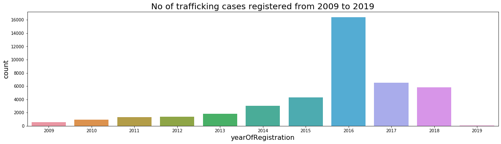

This repository is an attempt to generate insights about human trafficking by analysing data from Counter Trafficking Data Collaborative (CTDC),a global data hub on human trafficking, and building statistical/machine learning models.  
[This](./work.ipynb) notebook contains analysis on CTDC data.  

**Please agree** to the terms & conditions at https://www.ctdatacollaborative.org/terms-use  
Source: Counter-Trafficking Data Collaborative (CTDC), [May, 2020]

### Approach
The following [variables](https://www.ctdatacollaborative.org/sites/default/files/CTDC%20codebook%20v6_0.pdf) shall be treated as **target variable** one at a time during the analysis  
- isSexAndLabour	
- isForcedLabour  
- isSexualExploit	
- isOtherExploit	
- isForcedMarriage	
- isForcedMilitary	
- isOrganRemoval	
- isSlaveryAndPractices  

There seem to be 2 trends in the number of cases registered, one from 2009 until 2016 and the other from 2016 until 2019.  
It makes sense to analyse data with an increasing trend [2009,2016], finding factors that made the trend behave in the way it does, and likewise for the decreasing trend [2016,2019].  
Although [original](https://www.ctdatacollaborative.org/dataset/resource/511adcb7-b1a2-4cc7-bf2f-0960d43a49cc) data set contains records from 2002, for this analysis data from 2009 until 2019 is considered due to the trends observed as aforementioned.  

##### Tasks
- [x] create separate data sets for date ranges [2009,2016] & [2016,2019]  
- [x] create models with *isSexAndLabour* as target variable for both date ranges as mentioned above.  	
- [ ] create models with *isSexualExploit* as target variable for both date ranges as mentioned above. 
